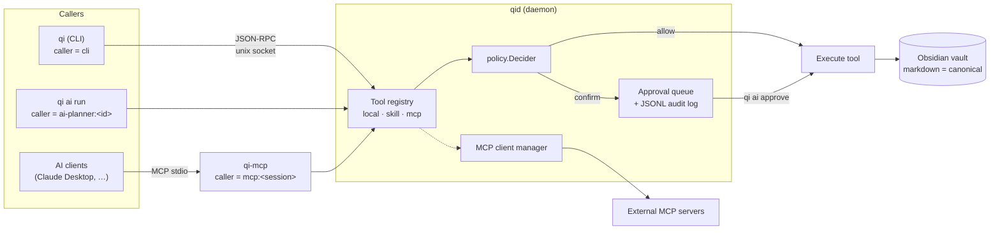
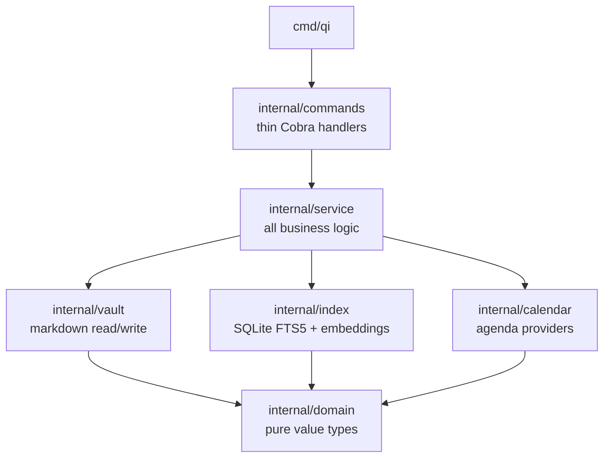
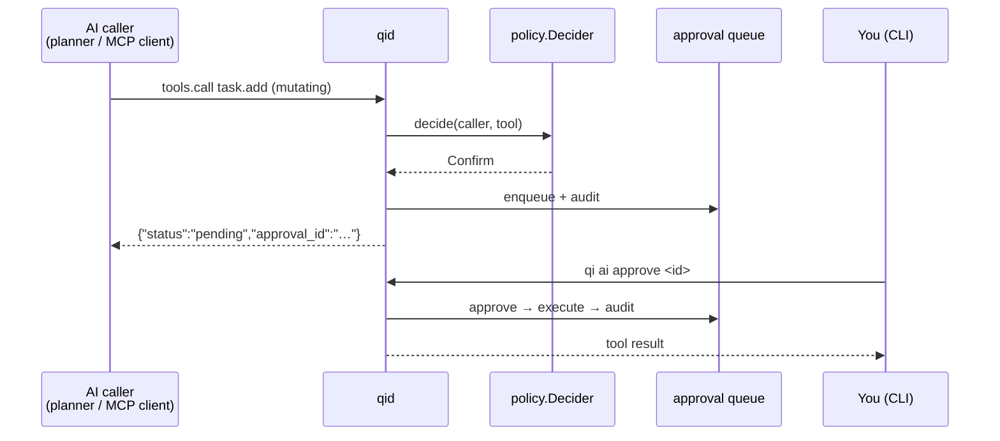
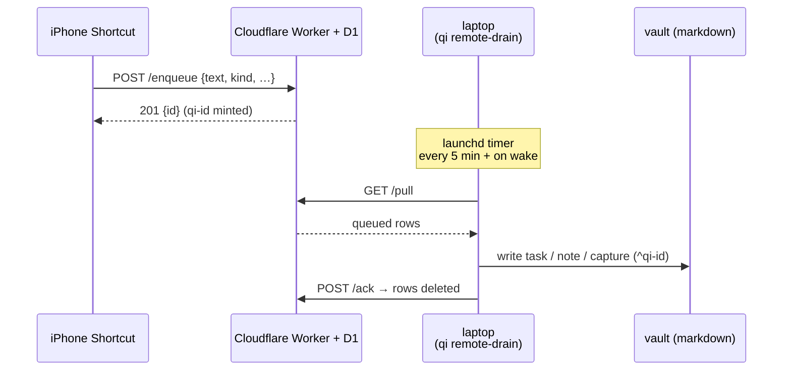

# qi

Go-first, local-first personal productivity CLI. Markdown is the source of truth. Fast by default. AI on demand, never silent.

**Contents:**
[Three binaries](#three-binaries) ·
[What's built](#whats-built) ·
[Quick start](#quick-start) ·
[CLI reference](#cli-reference) ·
[Configuration](#configuration) ·
[AI integration](#ai-integration) ·
[Cross-vault task sync](#cross-vault-task-sync) ·
[Remote capture](#remote-capture-cloud-queue) ·
[Architecture principles](#architecture-principles) ·
[Vault layout](#vault-layout) ·
[Development](#development) ·
[Roadmap](#roadmap)

---

## Three binaries

| Binary | Role |
|---|---|
| `qi`     | Stateless CLI — task / capture / note / search / agenda / plan + `qi ai *` to talk to `qid`. |
| `qid`    | Long-running local orchestrator — tool registry, MCP fan-out, policy, approval queue, audit log, fsnotify sync watcher, due-today notifier. Listens on a unix socket. |
| `qi-mcp` | MCP server that re-publishes `qid`'s tool catalog to AI clients (Claude Desktop, etc.) over stdio. Mutating calls route to the approval queue. |



---

## What's built

### CLI layering

Strict one-way dependency: commands are wiring, services own the logic, the vault owns the markdown.



### Vault primitives

| Package | What it does |
|---|---|
| `internal/domain` | `Task`, `Note`, `Event` value types — no I/O |
| `internal/vault` | Obsidian-compatible markdown parser/formatter (`ParseTaskLine`, `FormatTaskLine`, `ReadTasks`, `AppendTask`, `UpdateTaskLine`, `WriteCapture`, `WriteNote`) + recurrence engine (`NextRecurrence`) |
| `internal/service` | `TaskService`, `CaptureService`, `NoteService`, `AgendaService`, `InboxService`, plan/drain logic — all business logic |
| `internal/index` | SQLite FTS5 (modernc.org/sqlite, pure Go) — `Open`, `Rebuild`, `SearchWith`, plus an opt-in `note_embeddings` table for semantic search. Derived state, fully rebuildable from markdown. |
| `internal/embed` | Tiny Ollama `/api/embed` client used by `qi embed` and `qi search --semantic` |
| `internal/sync` | Cross-vault 3-way merge engine behind `qi sync` |
| `internal/calendar` | `Provider` interface, `LocalProvider` (parses `30-daily/`), `ICSProvider`, `CalDAVProvider`, Google OAuth + Calendar API |
| `internal/remotequeue` | HTTP client for the Cloudflare Worker cloud queue (`qi remote-drain` / `remote-status`) |
| `internal/config` | TOML loader with env var overrides, XDG-compliant paths, `[[client]]` / `[[client.project]]` resolution |
| `internal/tui` | Bubble Tea pickers + the `qi inbox` triage flow |

### AI infrastructure

| Package | What it does |
|---|---|
| `internal/tools` | In-memory tool registry. `SourceLocal`, `SourceMCP`, `SourceSkill`. `RegisterLocal`/`RegisterSkill`/`RegisterDynamic`/`Unregister`. JSON-tagged so the wire shape matches MCP catalog format. |
| `internal/tools/builtin` | Local tools wired into the registry: `vault.capture` (mutating), `task.add` (mutating), `task.list`, `note.search`, `agenda.today`. |
| `internal/skills` | Composed deterministic workflows registered as `SourceSkill` — see the table below. Never call an LLM, never write silently. |
| `internal/mcp` | `Manager` connecting external MCP servers via `mark3labs/mcp-go` stdio, registering their tools into the catalog under `mcp.<server>.<tool>`. |
| `internal/daemon` | JSON-RPC 2.0 server over unix socket. Methods: `tools.list`, `tools.call`, `approval.list/get/approve/deny`. ndjson framing matches MCP stdio convention. |
| `internal/daemon/client` | Typed JSON-RPC client. `Dial`, `Call`, `CallToolAs(caller, …)`, approval helpers. |
| `internal/policy` | `Decider` interface + `DefaultDecider`. Rules: empty caller → Deny; `cli` → Allow; read-only → Allow; mutating + non-cli → Confirm. |
| `internal/approval` | In-memory queue with state machine + append-only JSONL audit log. Every Enqueue/Approve/Deny/Execute/Fail is recorded. |
| `internal/qimcp` | Bridge that exposes `qid`'s catalog to MCP clients. Calls land as `caller="mcp:<sessionID>"`. |
| `internal/ai` | LLM-driven tool-use planner with provider-neutral interface. Backends: Anthropic (with prompt caching) and Ollama (stdlib HTTP). |
| `internal/watcher` | Opt-in fsnotify auto-reconcile: `[sync] watch = true` makes `qid` run `sync.Reconcile` (debounced) on any task-file change. |
| `internal/notify` | Opt-in morning due-today notifier: `[notify] due_today = true` schedules one macOS banner a day listing tasks due/scheduled today. |

### Skills (deterministic workflows)

| Tool | Mutating | What it does |
|---|---|---|
| `skill.daily-review` | no | Today's agenda + open tasks + recent captures |
| `skill.process-inbox` | no | Proposes task/note/archive per `00-inbox/` capture (deterministic heuristics) |
| `skill.process-inbox-apply` | **yes** | Executes one proposed inbox action |
| `skill.weekly-review` | no | Aggregates the week's completed tasks, capture volume, and daily `## Logs` highlights into a proposed review note |
| `skill.weekly-review-apply` | **yes** | Writes the given review title+body as a note |
| `skill.quick-task` | **yes** | Add a task and return the refreshed open list in one call |
| `skill.session-log` | **yes** | Append a timestamped entry to today's daily `## Logs` (headless `qi daily cp`) |

All packages have unit tests; race detector clean.

---

## Quick start

```bash
# Prerequisites: Go 1.25+

go mod tidy
go test ./...

mkdir -p ~/.config/qi
cat > ~/.config/qi/config.toml <<EOF
vault_path = "/path/to/your/obsidian/vault"
EOF

# Or: export QI_VAULT_PATH=/path/to/your/vault

# Build
go build -o bin/qi     ./cmd/qi
go build -o bin/qid    ./cmd/qid
go build -o bin/qi-mcp ./cmd/qi-mcp

# Stateless CLI works without qid:
bin/qi capture "Remember to fix the parser"
bin/qi task add "Fix the parser" --project qi --due 2026-05-01
bin/qi task list
bin/qi search "parser"

# Start qid for AI / MCP features:
bin/qid &

# Talk to qid:
bin/qi ai tools list
bin/qi ai tools call skill.daily-review
bin/qi ai run "what's on my schedule today?"
```

---

## CLI reference

### Stateless commands (work without `qid`)

```
qi capture <text>             # alias: qi c <text>
qi task add <text> [--project <tag> | --client <name>] [--due YYYY-MM-DD]
                   [--schedule YYYY-MM-DD] [--repeat "every week"]
qi task list
qi task done [fuzzy-text]
qi sync [--dry-run]           # reconcile tasks with project vaults (see Cross-vault sync)

qi note new "title" [--body "..."] [--project <tag> | --client <name>]
qi note list
qi note search "query"        # FTS, notes only
qi search <query> [--kind note|task|daily|inbox|other] [--limit N] [--semantic]
qi index rebuild
qi embed                      # build the local embedding index (requires [embeddings])

qi inbox [--dry-run]          # interactively triage 00-inbox captures (task/note/archive/delete)

qi agenda                     # today's events (local + any ICS / CalDAV / Google)
qi agenda week
qi calendar ...               # Google OAuth (auth, accounts, list) + CalDAV keychain
                              # (caldav-list / caldav-passwd / caldav-forget)

qi daily start                # open today's note, write events into ## Agenda
qi daily cp <text>            # append a timestamped checkpoint to ## Logs

qi plan [date] [--start 09:00] [--block 30m] [--limit 6] [--project <tag>] [--all] [--dry-run]
                              # auto-time-block open tasks into the daily ## Schedule

qi launch harness [--project <tag> | --client <name>]   # alias: qi launch ai
                              # launch your AI harness with QI_VAULT_PATH + cwd resolved

qi config edit                # open the config file in $EDITOR

qi doctor                     # health check: config, vault, qid socket, index, worker
qi remote-status              # pending + deadletter counts in the cloud queue (read-only)
qi remote-drain [--limit 100] [--show-failed]   # pull queued remote items into the vault (see Remote capture)
```

`qi search` is a unified FTS search across the whole vault — every hit is prefixed with a
`[kind]` tag (note/task/daily/inbox/other), `--kind` filters, `--limit` caps results
(default 20). `--semantic` switches to cosine ranking over local embeddings: opt in with
`[embeddings] enabled = true`, run `qi embed` once (and after big vault changes), and
scores are appended as `(0.NN)`. Embeddings come from a local Ollama
(`nomic-embed-text` by default) — nothing leaves the machine.

`qi plan` packs open tasks due/scheduled that day (`--all` for every open task) into the
next free slots of the daily note's `## Schedule`, preserving hand-authored entries and
skipping already-scheduled titles, so re-running it is idempotent. Planned blocks surface
in `qi agenda` automatically.

`qi doctor` reports per-component status and exits non-zero only on a hard **fail** (missing
config-derived vault, unreachable Worker); optional/lazy components (no daemon, unbuilt index)
report **warn** and don't fail. `qi remote-status` is a no-op when `[remote_queue]` is disabled.

`--due` writes the Obsidian Tasks due marker (`📅 YYYY-MM-DD`); `--schedule` writes the
scheduled marker (`⏳ YYYY-MM-DD`); `--repeat` writes the recurrence marker (`🔁 <rule>`).
All are optional and shown by `qi task list`.

### `qi ai` — requires `qid` running

```
qi ai tools list                              # show registered tools
qi ai tools call <name> [--args '{"k":"v"}'] [--caller cli|ai|...]
qi ai approvals [--status pending|approved|denied|executed|failed]
qi ai approve <id>                            # runs the queued tool
qi ai deny <id> [--reason "..."]
qi ai run "<prompt>" [--provider anthropic|ollama] [--model <id>]

qi daily end [YYYY-MM-DD] [--provider …] [--model …]
                                              # AI-summarize a day's ## Logs into ## Summary
                                              # (confirm before write; defaults to today)
```

All `qi ai` subcommands and `qi daily end` take `--socket <path>` to override the qid
socket location (mirrors `qid --socket`).

Captures land in `00-inbox/` with a timestamped filename:
```
00-inbox/2026-04-23-225939.md
```

Tasks are Obsidian-compatible — project tag first, then recurrence, scheduled, due,
done-date, and a stable block ref:
```
- [ ] Buy milk #qi 🔁 every week 📅 2026-05-01 ^qi-a1b2c3d4
- [x] Ship report #acme 📅 2026-05-27 ✅ 2026-05-27 ^qi-e5f6a7b8
```
Supported recurrence rules: `every [N] day|week|month|year`, optionally `when done`.
Completing a recurring dated task keeps the done line and appends a fresh open instance
with advanced dates and a new id.

---

## Configuration

Priority: **env vars > `~/.config/qi/config.toml` > defaults**

```toml
# ~/.config/qi/config.toml
vault_path     = "/Users/you/Documents/vault"
task_file_path = "10-tasks/inbox.md"   # optional, relative to vault_path

daily_dir_format  = "30-daily"         # optional; daily-note dir, supports YYYY/MM/MMMM tokens
daily_file_format = "YYYY-MM-DD"       # optional; daily-note filename pattern

# --- Calendars (any combination) ---

[[ics_calendars]]
name = "Client A"
url  = "https://calendar.google.com/calendar/ical/.../basic.ics"

[[caldav_calendars]]
name     = "Client A"
email    = "raymond@clientdomain.com"   # alias for `username`
password = "xxxx xxxx xxxx xxxx"        # Google App Password — or omit and use `qi calendar caldav-passwd`
# endpoint = "https://…"                # optional; defaults to Google's CalDAV endpoint
# path     = "…"                        # optional; pin one calendar (discover with `qi calendar caldav-list`)

[google_oauth]                     # required for [[google_calendars]] (qi calendar auth)
client_id     = "....apps.googleusercontent.com"
client_secret = "..."

[[google_calendars]]
name        = "Personal"
account     = "you@gmail.com"
calendar_id = "primary"

# --- External MCP servers connected by qid ---

[[mcp_servers]]
id      = "github"
command = "/usr/local/bin/mcp-github"
args    = ["--mode", "stdio"]
env     = { GITHUB_TOKEN = "..." }

# --- AI provider for `qi ai run` ---

[ai]
provider     = "anthropic"          # or "ollama"
model        = "claude-sonnet-4-6"  # used when provider=anthropic
ollama_url   = "http://localhost:11434"
ollama_model = "qwen3:14b"

# --- Opt-in local semantic search (`qi embed` / `qi search --semantic`) ---

[embeddings]
enabled    = true
model      = "nomic-embed-text"           # optional; default nomic-embed-text
ollama_url = "http://localhost:11434"     # optional

# --- Default AI harness for `qi launch harness` ---

[launch]
harness = "claude"     # binary to exec
args    = []           # optional extra args
detach  = false        # true: spawn and return instead of replacing the qi process

# --- Opt-in qid extras ---

[sync]
watch       = true    # qid watches task files and auto-runs sync.Reconcile
debounce_ms = 750     # optional; default 750

[notify]
due_today = true      # one macOS banner a day listing tasks due/scheduled today
at        = "08:00"   # optional; HH:MM 24h, default 08:00

# --- Clients & projects (cross-vault task sync + launch) ---

[[client]]
name       = "Acme"                       # required; matched by --project / $WORK_CONTEXT
vault_path = "/Users/you/Vaults/Acme"     # required; Obsidian notes vault (-> QI_VAULT_PATH)
dev_root   = "/Users/you/Development/Acme" # optional; root for relative project dev_path
task_file  = "10-tasks/_acme.md"          # optional; client-wide tasks (qi task add --client Acme)
notes_path = "00-inbox"                   # optional; dir for qi note new --client (default 00-inbox)
  [client.launch]                         # optional; default harness for the client's projects
  harness = "claude"

  [[client.project]]
  project = "acme"                        # required; matches a task's first #tag

  [[client.project]]
  project  = "widget"
  vault_path = "/Users/you/Vaults/Widget" # optional; overrides the client vault for this project
  path      = "10-projects/Widget"        # optional; base subdir; relative task_file/notes_path resolve under it
  dev_path  = "widget-svc"                # cwd for `qi launch harness`; relative -> under dev_root
  task_file = "tasks.md"                  # optional; default 10-tasks/<project>.md (under path when set)
  notes_path = "notes"                    # optional; default 00-inbox (under path; inherits client when unset)
    [client.project.launch]               # optional; overrides the client harness
    harness = "aider"
    args    = ["--model", "sonnet"]
```

A `[[client]]` is one Obsidian vault + one dev root shared by its `[[client.project]]` entries. `vault_path` is exported as `QI_VAULT_PATH`; a project's `dev_path` (absolute, or relative to `dev_root`) is the working directory `qi launch harness` runs in. `qi launch harness` resolves its target — `--project`, else `$WORK_CONTEXT` — **project-first, then client**: a project match uses the project's `dev_path`; a client match uses the client's `dev_root`; no match runs the global `[launch]` harness in the current directory. Harness precedence: `[client.project.launch]` > `[client.launch]` > `[launch]` > `$AI_HARNESS` > `$AI_EDITOR`. Validation rejects a missing client `name`/`vault_path`, a missing project tag, duplicate client names, duplicate project tags, two projects resolving to the same file, or a relative `dev_path` with no `dev_root`.

A client may also set `task_file` to become a sync target for client-wide tasks: `qi task add --client Acme "…"` tags the task `#Acme` and routes it to that file (the client name becomes a project tag, so it must not collide with a `[[client.project]]`). `--client` / `--project` also route notes — `qi note new --client Acme "…"` writes into that vault's configured notes dir (`notes_path`, default `00-inbox`) instead of the main vault (such notes aren't in the `qi note search` index, which only covers the main vault), and `qi launch harness --client Acme` is shorthand for resolving the client.

A project's optional `path` is a base subdirectory within the vault: relative `task_file` and `notes_path` — and their defaults (`10-tasks/<project>.md`, `00-inbox`) — resolve under `vault_path + path`, so a project that keeps its docs in one folder need not repeat that prefix. Absolute `task_file`/`notes_path` ignore `path`. A project's `notes_path` inherits the client's when unset (default `00-inbox`).

| Env var | Purpose |
|---|---|
| `QI_VAULT_PATH`     | Override vault path |
| `QI_TASK_FILE_PATH` | Override task file path |
| `QI_AI_PROVIDER`    | `anthropic` or `ollama` (overrides `[ai].provider`) |
| `ANTHROPIC_API_KEY` | Anthropic API key for `qi ai run` |
| `OLLAMA_URL`        | Override Ollama base URL (default `http://localhost:11434`) |
| `QI_QUEUE_TOKEN`    | Drain token for the cloud queue (preferred over config) |

App Password (CalDAV): Google Account → Security → 2-Step Verification → App passwords. ⚠️ Plaintext — `chmod 600 ~/.config/qi/config.toml`, or skip the `password` key and store it in the macOS keychain instead with `qi calendar caldav-passwd <name>`.

Local daily-note events in `30-daily/YYYY-MM-DD.md` under `## Schedule`:
```markdown
## Schedule
- 09:00 Team standup
- 09:30-10:30 Design review #qi
- 14:00 Coffee #team
```
Format: `- HH:MM[-HH:MM] Title [#project]`. `qi plan` writes the same format, so planned
blocks parse back as agenda events.

---

## AI integration

### The approval gate

Every tool call carries a `caller` identity. The policy decider routes by caller + tool mutability:

| Caller | Read-only tool | Mutating tool |
|---|---|---|
| `cli`               | Allow | Allow (you are the user) |
| `ai-planner:<id>`   | Allow | Confirm (queued for approval) |
| `mcp:<sessionID>`   | Allow | Confirm (queued for approval) |
| (empty)             | Deny  | Deny |



When a mutation is queued, the caller receives `{"status":"pending","approval_id":"…"}`. A human must approve via `qi ai approve <id>` before it runs. Every transition (enqueue / approve / deny / execute / fail) is appended to `audit.log` next to the daemon socket.

### `qi ai run`

Runs a tool-use loop. The planner:
1. Fetches `tools.list` from `qid`.
2. Sends them to the configured LLM with `cache_control` on the system block (Anthropic) for free prompt caching across iterations and re-runs.
3. For each `tool_use` the model emits, dispatches via `client.CallToolAs(ctx, "ai-planner:<id>", name, args)`.
4. Surfaces approval-pending responses back to the model so it can tell you which `qi ai approve` to run.
5. Stops when the model emits a final text turn (or hits `DefaultMaxIterations=8`).

### `qi-mcp`

Connect Claude Desktop (or any MCP client) by pointing it at the `qi-mcp` binary with the qid socket path:
```json
{
  "mcpServers": {
    "qi": {
      "command": "/full/path/to/bin/qi-mcp",
      "args": ["-socket", "/Users/you/.local/state/qi/qid.sock"]
    }
  }
}
```
The AI client sees the full live catalog: the builtins (`vault.capture`, `task.add`, `task.list`, `note.search`, `agenda.today`), every skill from the table above, and every `mcp.<server>.<tool>`. Read-only tools run immediately; mutating ones route to the approval queue exactly like `qi ai run`.

---

## Cross-vault task sync

`qi sync` reconciles project tasks between the main qi vault and per-project Obsidian
vaults, so the same task is editable in both places and the main vault keeps the full
picture. Configure clients and their projects under `[[client]]` (see Configuration).

- **Per-project files.** A tagged task lives in `10-tasks/<project>.md` (untagged →
  `inbox.md`). `qi task list` / `done` aggregate across all of them.
- **Stable IDs.** Each task line carries an Obsidian block ref, e.g.
  `- [ ] Ship it #acme 📅 2026-05-27 ^qi-a1b2c3d4`. It is append-only and ignorable —
  Obsidian, Tasks, and Dataview treat the line normally. A line with no `^qi-` ID added
  inside a project vault is treated as new and gets an ID minted on the next sync.
- **Bidirectional 3-way merge.** Adds, edits, completions, and deletes flow both ways.
  A genuine two-sided edit of the same task is never clobbered — both lines are kept and
  one is tagged `#sync-conflict` for you to resolve by hand.
- **Safe against Obsidian Sync.** Writes are atomic and guarded against a sync rewrite
  landing mid-reconcile; a sync that detects a concurrent change aborts and retries rather
  than losing data. The merge ancestor lives in the SQLite index — derived, rebuildable,
  never canonical.
- **Hands-free option.** With `[sync] watch = true`, `qid` watches the canon + projection
  task dirs with fsnotify and runs the same reconcile (debounced, default 750ms) on any
  `.md` change — no manual `qi sync` needed while the daemon runs.

`qi sync --dry-run` prints the plan without writing. Run sync on one always-on machine;
each vault syncs independently through Obsidian Sync, with qi as the only bridge between them.

> Markdown stays canonical: projection files are real editable task lists, and `qi` never
> needs to be running for the vaults to work.

---

## Remote capture (cloud queue)

Add tasks, notes, or captures from your phone — or anywhere — **even while the laptop is
closed or offline.** The cloud holds the *intent*; your laptop stays the only writer of
the vault, so markdown stays canonical and no remote caller ever mutates it directly.



Each queued item carries a `kind` — `task` (default), `note`, or `capture` — and
`qi remote-drain` routes by it: tasks land in the task file (id-idempotent), notes become
vault notes, captures land in `00-inbox/`. An unknown kind is deadlettered, never silently
dropped. Items created **on** the laptop skip the queue entirely (the CLI writes the vault
directly). The queue is inbound-only — remote → cloud → laptop — and a row dies the
moment its content lands in the vault. Full design: [docs/cloud-queue-spec.md](docs/cloud-queue-spec.md).

**Cloud side** (`worker/` — Cloudflare Worker + D1, free tier):
```sh
cd worker && npm install && wrangler login
wrangler d1 create qi-queue        # paste database_id into wrangler.toml
npm run db:init                    # apply schema.sql
wrangler secret put ENQUEUE_TOKEN  # phone token  (enqueue only)
wrangler secret put DRAIN_TOKEN    # laptop token (pull/ack/deadletter)
wrangler deploy
```

**Laptop side** — config (`~/.config/qi/config.toml`):
```toml
[remote_queue]
enabled = true
url     = "https://qi-queue.<subdomain>.workers.dev"
# token via env QI_QUEUE_TOKEN (preferred) or set here
```
Then drain on a timer with launchd (template: [init/com.olddognewflex.qi-drain.plist](init/com.olddognewflex.qi-drain.plist)):
```sh
cp init/com.olddognewflex.qi-drain.plist ~/Library/LaunchAgents/
# edit the plist: set the qi path, QI_VAULT_PATH, and (if not in config) QI_QUEUE_TOKEN
launchctl bootstrap gui/$(id -u) ~/Library/LaunchAgents/com.olddognewflex.qi-drain.plist
```
A `StartInterval` timer that misses firings during sleep fires once on wake, so closing
the lid for hours means one catch-up drain on reopen. Run `qi remote-drain` by hand to
drain immediately; `qi remote-drain --show-failed` lists rejected (deadlettered) items.

**iPhone Shortcut:** *Get Contents of URL* → `POST <url>/enqueue`, header
`Authorization: Bearer <ENQUEUE_TOKEN>`, JSON body `{"text": <text>, "source": "ios-shortcut"}`
(optionally `"kind": "note"` or `"capture"`). The `201` response returns the minted `id`.
Add it to the Share Sheet to capture from any app.

**Security:** two scoped tokens (a leaked phone token can't drain or delete the queue);
TLS by default; the laptop re-validates every pulled item (the cloud is untrusted input);
queued text sits in the cloud only until the next drain deletes it.

---

## Architecture principles

- **Markdown is canonical.** If `qi` disappears, your vault still works with grep and your editor.
- **Capture latency < 100ms.** No network, no AI, no blocking on the `qi capture` hot path; CLI does not depend on `qid` for vault writes.
- **Commands are thin.** All logic lives in `internal/service` and `internal/skills`. Commands are wiring only.
- **AI is opt-in and confirmation-gated.** No silent LLM usage. Any AI-proposed mutation goes through the approval queue.
- **SQLite is a derived index.** Both FTS and embeddings are fully rebuildable from markdown (`qi index rebuild` / `qi embed`).

---

## Vault layout

```
vault/
├── 00-inbox/       # qi capture writes here
├── 10-tasks/
│   ├── inbox.md    # untagged tasks
│   └── <project>.md  # per-project tasks (one file per #tag)
├── 20-notes/
└── 30-daily/       # local agenda source + qi plan target
```

Configured project vaults receive a projection file (default `10-tasks/<project>.md` in
that vault), reconciled by `qi sync`. See Cross-vault task sync.

Machine-local state (never in vault, never synced):
```
~/.local/share/qi/qi.db          # SQLite FTS5 index + optional embeddings
~/.local/state/qi/qid.sock       # qid unix-domain socket
~/.local/state/qi/audit.log      # append-only approval audit (JSONL)
```
Honors `XDG_DATA_HOME` and `XDG_RUNTIME_DIR` / `XDG_STATE_HOME` when set.

---

## Development

```bash
make tidy    # go mod tidy
make test    # go test ./...
make run     # go run ./cmd/qi

go test ./... -race    # race detector
go build -o bin/qid ./cmd/qid
go build -o bin/qi-mcp ./cmd/qi-mcp
```

Smoke-test fixtures under `internal/*/testdata/` are ignored by `go build ./...` per Go convention — build explicitly when needed:
```bash
go build -o /tmp/echoserver ./internal/mcp/testdata/echoserver
go build -o /tmp/mcpdriver  ./internal/qimcp/testdata/mcpdriver
```

`raycast/` holds Raycast script-command bridges (`task-add.sh`, `task-list.sh`) for
adding/listing tasks from the Raycast launcher.

---

## Roadmap

### Done
- Phase 1 — Tasks
- Phase 2 — Capture
- Phase 3 — Notes + FTS5 search
- Phase 4 — Calendar (local, ICS, CalDAV, Google OAuth)
- Tool registry + JSON-RPC daemon (`qid`)
- External MCP fan-out (`mark3labs/mcp-go`)
- Policy decider + approval queue + JSONL audit
- `qi-mcp` MCP server bridge
- AI planner with provider abstraction (Anthropic + Ollama)
- Cross-vault task sync (`qi sync`, `[[client]]` / `[[client.project]]`)
- Builtin tools (`vault.capture`, `task.add`, `task.list`, `note.search`, `agenda.today`)
- Skills: `daily-review`, `process-inbox`(+`-apply`), `weekly-review`(+`-apply`), `quick-task`, `session-log`
- `qi doctor` health check, `qi remote-status` cloud-queue visibility
- Inbox triage TUI (`qi inbox`) — interactive task/note/archive/delete per capture
- Remote capture cloud queue (Cloudflare Worker + D1) with kind routing (task/note/capture)
- Recurring tasks (`🔁 every …`) + done-dates (`✅`)
- Unified vault search (`qi search`) + opt-in local semantic search (`qi embed`, Ollama embeddings)
- `qi plan` — idempotent auto-time-blocking into the daily `## Schedule`
- fsnotify sync watcher in `qid` (`[sync] watch`) — near-real-time reconcile
- Morning due-today notifier (`[notify] due_today`)
- `qi launch harness` — context-aware AI harness launcher

### Next
- Streaming planner output (`Messages.NewStreaming`)
- Conversation-history caching (second cache breakpoint mid-loop)
